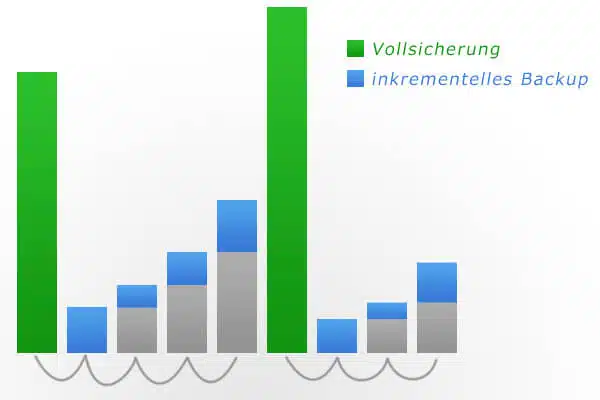
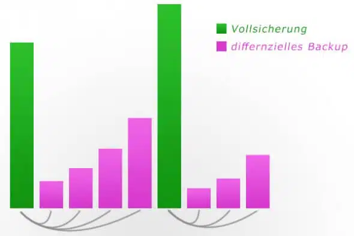

# WS01

Verfasser: **Leonhard Stransky, 4AHIT**

Datum: **13.09.2023**

## Einführung

In der vorliegenden Übung sollt ihr euch mit der Planung und Umsetzung von Datensicherungen, im Speziellen in Datenbanksystemen beschäftigen.

## Projektbeschreibung

### Recherche:

Hierfür arbeitet zunächst diesen [Artikel](https://www.grundlagen-computer.de/backup/backup-strategien-inkrementell-differentiell-und-vollbackup) durch und fasst eure Ergebnisse in einem Protokoll zusammen. Führt auch an wie ein sinnvoller Restore (Wiederherstellung) der Daten bei den entsprechend durchgeführten Backups vonstatten geht und welche Probleme oder Engpässe sich dabei auftun. Wichtig ist der praktische Bezug, sprich Code Beispiele die Ihr in eurem Protokoll als auch im Abnahmegespräch anführt und durchführt.

Im Anschluss arbeitet in der PostgreSQL Dokumentation das Kapitel [Backup an Restore](https://www.postgresql.org/docs/current/backup.html) durch und ergänzt entsprechend eure Ausarbeitung Backups um die konkreten Umsetzungsmöglichkeiten in PostgresSQL.

### Übung:

Als abschließender Schritt soll nun ein umfassendes Beispiel eurer Dokumentation hinzugefügt werden, in dem Ihr die zuvor erlernten Konzepte praktisch mittels einer Beispieldatenbank umsetzt und erläutert.

Setzt hierfür zumindest folgende Backupmöglichkeiten von Postgres SQL praktisch um (dump, continouse archiving, file system level backup, WAL files, point in time recovery) und führt an welche Backup Art (Vollbackup, inkrementelles Backup oder differentielles Backup) ihr so umsetzen könnt.

Das Prinzip: Je mehr desto 1

## Aufgaben:

### Zusammenfassung vom Artikel:

#### Inkrementelles Backup:

1.1 Vorteile vom inkrementellen Backup
- Einfaches Verfahren
- niedriger Speicherbedarf (wegen den kleinen inkrementellen Backups)
- Wiederherstellung der Daten zu jedem Backupzeitpunkt möglich

1.2 Nachteile vom inkrementellen Backup
- Es sind das Vollbackup und ALLE seitdem gemachten Bänder notwendig



#### Differentielles Backup:

2.1 Vorteile des differentiellen Backups
- weniger Speicherbedarf als bei Vollbackup, aber mehr als beim inkrementellen Backup
- Vollbackup und die differentielle Sicherung zum gewünschten Zeitpunkt notwendig

2.2 Nachteile des differentiellen Backups
- Dateien, die einmal verändert werden, müssen bei jedem differentiellen Backup neu gesichert werden. Dadurch hat man ein erhöhtes Datenaufkommen.

 

#### Vollbackup:

3.1 Vorteile vom Vollbackup
- Ein Band zur Wiederherstellung notwendig
- einfache Wiederherstellung

3.2 Nachteile des Vollbackups
- Sehr hoher Speicherbedarf
- um mehrere Versionen zu haben, müssen mehrere Sicherungsbänder aufbewahrt werden


#### Was ist die optimale Backup-Strategie?

Die Backup-Methode wird je nach Anwendungsfall gewählt. Jedoch ist eine Kombination
aus allen drei Strategien am Besten.

#### Probleme und Engpässe bei der Wiederherstellung:

- Bei der inkrementellen und differentiellen Backup-Strategie ist es wichtig, dass die Backups in der richtigen Reihenfolge wiederhergestellt werden. 

- Die Integrität der Backups ist wichtig. Wenn ein Backup beschädigt ist, kann die Wiederherstellung scheitern.

- Regelmäßiges testen der Backup-Strategien ist wichtig, um sicherzustellen, dass die Backups ordnungsgemäß funktionieren.

### PostgresSQL Backup und Restore:

#### SQL Dump:

Bei einem Sql Dump wird eine datei mit den SQL Befehlen erstellt, die nötig sind um die Datenbank wiederherzustellen.

Erstellen eines SQL Dumps:

```bash
# Dabei wird der vorherige Dump überschrieben
pg_dump dbname > dumpfile
```

Wiederherstellen eines SQL Dumps:

```bash
psql dbname < dumpfile
```

Um eine ganze Datenbank zu speichern:

```bash
pg_dumpall > dumpfile
psql -f dumpfile postgres
```

Bei einer besonders großen Datenbank:

Dumps komprimieren:
    
```bash
pg_dump dbname | gzip > filename.gz
gunzip -c filename.gz | psql dbname
```

Splitting files:

```bash
pg_dump dbname | split -b 2G - filename
cat filename* | psql dbname
```

Custom dump format pg_dump:

```bash
pg_dump -Fc dbname > filename
pg_restore -d dbname filename
```

Custom dump format pg_dumpall: (Mehrere Tabellen)

```bash
pg_dump -j num -F d -f out.dir dbname  
```

#### File System Level Backup:

Dabei werden die Datenbankdateien direkt kopiert und gespeichert.

```bash
tar -cf backup.tar /usr/local/pgsql/data
```

Die Datenbank muss während des Backups gestoppt werden.

Außerdem können einzelne Tabellen nicht gespeichert werden.

Daher muss man alles sichern.

#### WAL Backups:

WAL (Write Ahead Log) ist ein Protokoll, das alle Änderungen an der Datenbank in Dateien speichert.
Damit man die Datenbank wiederherstellt wird ein vollständiges Backup (point-in-time recovery) 
und alle WAL Dateien benötigt.   

#### Continouse Archiving:

Continuous Archiving wird genutzt, um eine fortlaufende Sicherung von WAL-Segmenten über einen längeren Zeitraum zu gewährleisten. Dies ist entscheidend für Point-in-Time-Recovery (PITR).

#### Point in time recovery:

Point in Time Recovery (PITR) wird verwendet, um eine PostgreSQL-Datenbank auf einen bestimmten Zeitpunkt in der Vergangenheit wiederherzustellen. Dies ermöglicht die Wiederherstellung von Daten zu einem beliebigen Zeitpunkt.

## Praxis:

In Docker habe ich ein Postgres Image gestartet. Jedoch gab es Probleme mit dem Container, da er immer wieder abstürzte.

Deshalb habe ich PostgreSQL auf einer ubuntu server vm installiert.

Über DataGrip habe ich eine Verbindung zur Datenbank hergestellt und 
mit einem SQL Create Script eine Datenbank erstellt und 
mit Daten befüllt.

Jedoch hatte die VM wieder andere Probleme.

Als ich dann Docker geupdatet und den Container neu gepullt habe, hat wieder alles funktioniert.

### SQL Dump:

```bash	
# Create Dump file:
# -U postgres: User postgres
# -c : clean (Adds commands to drop all database objects before creating)
pg_dump > pg_dumpV1 -U postgres -c

# Restore Dump file:
# -U postgres: User postgres
# -f : file
psql -f pg_dumpV1 postgres -U postgres

# Inhalt von pg_dumpV1:
cat pg_dumpV1
```

pg_dumpV1: (Beispiel)

```sql
--
-- PostgreSQL database dump
--

-- Dumped from database version 16.0 (Debian 16.0-1.pgdg120+1)
-- Dumped by pg_dump version 16.0 (Debian 16.0-1.pgdg120+1)

SET statement_timeout = 0;
SET lock_timeout = 0;
SET idle_in_transaction_session_timeout = 0;
SET client_encoding = 'UTF8';
SET standard_conforming_strings = on;
SELECT pg_catalog.set_config('search_path', '', false);
SET check_function_bodies = false;
SET xmloption = content;
SET client_min_messages = warning;
SET row_security = off;

ALTER TABLE ONLY public.messwerte DROP CONSTRAINT fk_mw2mp;
ALTER TABLE ONLY public.messwerte DROP CONSTRAINT fk_mw2mo;
ALTER TABLE ONLY public.messwerte DROP CONSTRAINT messwerte_pkey;
ALTER TABLE ONLY public.messpunkte DROP CONSTRAINT messpunkte_pkey;
ALTER TABLE ONLY public.messorte DROP CONSTRAINT messorte_pkey;
ALTER TABLE public.messwerte ALTER COLUMN mw_id DROP DEFAULT;
ALTER TABLE public.messpunkte ALTER COLUMN mp_id DROP DEFAULT;
ALTER TABLE public.messorte ALTER COLUMN mo_espid DROP DEFAULT;
DROP SEQUENCE public.messwerte_mw_id_seq;
DROP TABLE public.messwerte;
DROP SEQUENCE public.messpunkte_mp_id_seq;
DROP TABLE public.messpunkte;
DROP SEQUENCE public.messorte_mo_espid_seq;
DROP TABLE public.messorte;
SET default_tablespace = '';
```

### File System Level Backup:

```bash
# Create a tar archive file:
# -c : Create a new archive
# -f backup.tar: Specify the archive file name as "backup.tar"
# /usr/local/pgsql/data: The source directory to be archived
tar -cf backup.tar /var/lib/postgresql/data
```

### WAL Backups:

```bash
# Find postgresql.conf:
psql -U postgres -tA -c "SHOW data_directory;"

# Edit postgresql.conf:
nano /var/lib/postgresql/data/postgresql.conf
vim /var/lib/postgresql/data/postgresql.conf
```

postgresql.conf: (Changes)
```cfg
# Enable archiving of WAL files
wal_level = replica

# Enable WAL archiving
archive_mode = on

# Specify the command to execute for archiving WAL files
archive_command = 'cp %p /var/lib/postgresql/data/archive'

# Define a location to store archived WAL files
# archive_directory = '/var/lib/postgresql/data/archive'
```

## Quellen:

[1] wwww.grundlagen-computer.de 2023. *backup* [online] 
Available at: https://www.grundlagen-computer.de/backup/backup-strategien-inkrementell-differentiell-und-vollbackup [Accessed 13 September 2023].

[1] wwww.grundlagen-computer.de 2023. *backup* [online] 
Available at: https://www.postgresql.org/docs/current/backup.html [Accessed 13 September 2023].


